# Architecture — aws-streaming-batch-platform

> Skeleton. Filled in as phases land; schema decisions get documented here in
> Phase 2 once the sample data in `data/sample_raw/` is inspected.

## 1. Locked decisions

These are fixed. Changing any of them is an explicit, documented decision —
never a silent substitution.

| Layer | Choice | Why / Notes |
|---|---|---|
| Streaming ingestion | Kinesis Data Streams (AWS) / LocalStack Kinesis (local) | AWS-native; chosen over Kafka for service authenticity |
| Record format | Avro + AWS Glue Schema Registry; local shim under LocalStack Community | Schema evolution discipline; shim mimics registry validate/register interface, swaps automatically when `ENV=aws` |
| Processing engine | PySpark 3.5.x (Structured Streaming + batch) on EMR (AWS) / Spark in Docker (local) | Same code, both runtimes; Kinesis-Spark connector |
| Orchestration | Apache Airflow (Docker), DAGs MWAA-compatible | Optional Step Functions/MWAA Terraform module as alternate |
| Data lake | MinIO (local) / S3 (AWS), medallion `bronze/ → silver/ → gold/` | |
| Table format | Apache Iceberg | ACID, time travel, schema evolution; queryable via Spark/Trino/Athena |
| Query engine (local) | Trino (stand-in for Athena) | |
| Serving / warehouse | Redshift Serverless (AWS) / Postgres (local) | Same SQL/DDL works on both |
| BI layer | Power BI / SQL client; optional Streamlit app | |
| IaC | Terraform — `tflocal` for local, `envs/aws` for real | |
| Data quality | Great Expectations after bronze and after silver; failures → `quarantine/` | Never silently dropped |
| CI/CD | GitHub Actions — lint, tests, tf validate/plan, Docker build | |
| Observability | Prometheus + Grafana, structured JSON logging everywhere | Works identically on LocalStack or real AWS |
| Runtime pinning | Python 3.11, PySpark 3.5.x, Java 17 | Matched to an EMR release shipping Spark 3.5.x |
| Backfill/replay | Every batch job takes `--start-date`/`--end-date`; streaming supports shard/iterator reset | Non-negotiable |

## 2. End-to-end data flow

```mermaid
flowchart LR
    subgraph Source
        RAW["data/sample_raw/*"]
    end

    subgraph "Streaming Path"
        PROD["Producer script<br/>replays RAW at configurable rate"]
        KDS["Kinesis Data Stream<br/>(Avro + Glue Schema Registry)"]
        SS["EMR/Spark Structured Streaming<br/>validates schema, checkpoints"]
    end

    subgraph "Batch Path"
        HIST["Historical/backfill loader<br/>reads RAW directly, no Kinesis"]
    end

    subgraph "Data Lake (Iceberg on S3/MinIO)"
        BRONZE["bronze/ raw, append-only"]
        GEBRONZE{{"Great Expectations: bronze"}}
        SILVER["silver/ cleaned, deduped, typed"]
        GESILVER{{"Great Expectations: silver"}}
        GOLD["gold/ business marts"]
        QUAR["quarantine/ failed validation"]
    end

    subgraph Orchestration
        AF["Airflow DAGs (MWAA-compatible)"]
    end

    subgraph Serving
        WH["Warehouse load job<br/>Redshift Serverless / Postgres"]
        BI["Power BI / SQL client"]
        ST["Streamlit (optional)"]
    end

    subgraph Observability
        LOGS["Structured JSON logs"] --> PROM["Prometheus"] --> GRAF["Grafana"]
    end

    RAW --> PROD --> KDS --> SS --> BRONZE
    RAW --> HIST --> BRONZE
    BRONZE --> GEBRONZE
    GEBRONZE -- pass --> SILVER
    GEBRONZE -- fail --> QUAR
    AF -.triggers.-> SILVER
    SILVER --> GESILVER
    GESILVER -- pass --> GOLD
    GESILVER -- fail --> QUAR
    AF -.triggers.-> GOLD
    GOLD --> WH --> BI
    WH --> ST
    SS --> LOGS
    AF --> LOGS
```

In short: one streaming arrival path (producer → Kinesis → Spark → bronze) and
one bulk/backfill path (raw files → bronze), after which everything is
orchestrated batch — GE gate → silver → GE gate → gold → warehouse.

## 3. Component decisions log

| Date | Decision | Rationale |
|---|---|---|
| 2023 (project start) | Locked architecture table above | See guide.md Section 1 |

### Phase 2 — sample data (retail_db) decisions

Source: `data/sample_raw/retail_db/` — classic retail_db, 6 entities, headerless
comma-delimited text. Column order is defined in `config/entities.yaml`; the YAML is
the contract, not the file layout.

**Streaming vs batch split.** `orders` and `order_items` are the high-volume facts
(69k + 172k rows, grow over time) — they stream through Kinesis. `customers`,
`products`, `categories`, `departments` are small dimensions — they go through the
batch/backfill path directly into bronze. A real platform wouldn't push a static
dimension table through a stream either.

**Avro schema choices** (`streaming/schemas/orders.avsc`, `order_items.avsc`):
- `order_date` is a string (ISO-8601), not a logical timestamp — the source value has
  a trailing `.0` fractional that the reader normalizes; bronze keeps the raw-ish
  value and silver does typing.
- `order_status` is a string, not an enum — new statuses arrive without a registry bump.
- All IDs are `long`, quantities `int`, prices/subtotals `double`.

**Incremental loading.** Per-entity watermark in `data/state/<entity>.json` holding
the last sent value of the entity's incremental column (`order_date` for orders,
`order_item_id` for order_items — the latter has no date at source). Watermark is
**inclusive** (at-least-once): several orders share one timestamp, so strictly-after
filtering would silently drop rows. Re-sent duplicates are expected and safe — bronze
dedups on business key. Batch jobs accept `--start-date`/`--end-date` for backfill.

**Idempotency.** Three layers: (1) deterministic Kinesis partition key = business key,
so replays land on the same shard; (2) producer watermark makes reruns send only
new/last-cursor records; (3) bronze writes dedup on business key regardless.

**Validation & error handling.** Every row is validated against the Avro schema
before send. Rows failing raw parsing (wrong column count, uncastable types) or
schema validation go to `data/quarantine/<entity>.jsonl` with the reason — never
silently dropped, never crash the run. Kinesis writes retry with exponential backoff;
exhausted retries fail the run loudly rather than losing records.

**Schema registry.** Local runs use the file-backed shim in
`streaming/schemas/registry_shim.py` (LocalStack Community can't emulate Glue Schema
Registry). `ENV=aws` swaps in the boto3 Glue-backed class with the same interface.

### Phase 3 — streaming bronze (Spark Structured Streaming) decisions

**Stream-per-entity.** The producer originally sent both facts to a single
`retail-orders` stream. A Structured Streaming consumer binds one Avro schema per
stream (`from_avro` needs it upfront), so a mixed stream would be undecodable —
the contract is now `stream_name_template: retail-{entity}` in
config/settings.yaml: `retail-orders` and `retail-order_items`. The producer
resolves the template; LocalStack init pre-creates both.

**Kinesis connector.** `org.apache.spark:spark-streaming-sql-kinesis-connector_2.12:1.0.0`
(awslabs, released 7 Dec 2023; Spark 3.2+/Scala 2.12). Distributed as a public jar on
`awslabs-code-us-east-1.s3.amazonaws.com`, wired via `spark.jars`; format
`aws-kinesis` with `kinesis.endpointUrl` → LocalStack :4566 in local mode, omitted on
AWS. GetRecords consumer type (EFO costs extra on real AWS — documented, not used).
Its metadata committer needs no DynamoDB, which LocalStack Community lacks.

**Lake stack versions.** Iceberg 1.4.2 (Oct 2023, last 2023 release for Spark 3.5)
via `iceberg-spark-runtime-3.5_2.12`; `hadoop-aws:3.3.4` + `aws-java-sdk-bundle:1.12.262`
(match Spark 3.5.0's bundled Hadoop). Catalog `lake` type=hadoop, warehouse
`s3a://lake/warehouse` — the Hive-metastore upgrade is deferred until Trino needs
it (Phase 6).

**Bronze table shape.** `lake.retail.<entity>` = Avro field order (the contract) +
lineage columns `_kinesis_partition_key`, `_kinesis_sequence_number`,
`_kinesis_arrival_timestamp`, `_ingested_at`. Partitioned by `days(_ingested_at)` —
decoupled from source types, so bronze stays raw; silver owns typing. Iceberg
append via `writeTo(...).append()` inside foreachBatch = transactional
(no partial micro-batches visible).

**Validation & dead-lettering.** `from_avro` in PERMISSIVE mode: corrupt payloads
decode to nulls, and since every Avro field is non-nullable, "any null field" ==
"invalid record". Those rows go to
`s3a://lake/quarantine/streaming/<entity>/` as JSON (reason, lineage, base64 raw
payload — nothing lost, reprocessable), never into bronze.

**Idempotency.** Within each micro-batch: `dropDuplicates(business_key)` collapses
producer watermark re-sends. Across restarts: checkpointing at
`s3a://checkpoints/streaming/<entity>/` gives exactly-once offset tracking; Iceberg
commits are atomic. Cross-batch replay duplicates (e.g. a deliberate
`--reset-watermark` replay) are *expected* in bronze — bronze stays append-only raw,
and the silver MERGE job is the authoritative business-key dedup point.

### Phase 4 — batch layer (bronze -> silver -> gold) decisions

**Table layout.** `lake.retail.*` (bronze, shared with the streaming writer),
`lake.retail_silver.*`, `lake.retail_gold.*` — one catalog (`lake`, hadoop type),
one namespace per layer. No Hive metastore anywhere yet (deferred to Phase 6,
when Trino needs a shared catalog).

**Dimensions go straight to bronze (batch path).** `load_dimensions.py` reads the
same headerless raw files the producer replays for facts — how real platforms handle
file drops/backfills. The source is a plain path (local dir or `s3a://`, passed via
`--source-path` or settings.yaml), so the identical job runs as an EMR step. Write
semantics: **full-snapshot overwrite** per run (the raw file is a complete snapshot;
append would duplicate). Bronze dims keep source-faithful types (timestamps as raw
strings); malformed CSV rows (all-null under PERMISSIVE) go to
`s3a://lake/quarantine/bronze/<entity>/`.

**Silver = typing + authoritative dedup.** `bronze_to_silver.py` handles all six
entities. Facts: `order_date` string -> timestamp, `--start-date/--end-date` applied
as ISO lexicographic bounds (order_items have no date — they're bounded through a
semi-join on their filtered orders). Dedup is a single Iceberg **MERGE INTO** on the
business key keeping the newest `_ingested_at` (hence Iceberg v2 tables,
`format-version=2`). This is the layer that makes the whole pipeline idempotent:
whatever duplicates bronze holds (stream replays, watermark re-sends, double
delivery), silver holds exactly one row per business key. Dims: cast + same MERGE
mechanism (source-deleted rows linger — acceptable for static snapshots; noted).
Business-key nulls or unparseable dates/negative amounts -> quarantine JSON at
`s3a://lake/quarantine/silver/<entity>/`, never dropped.

**Gold = full recompute per run.** `silver_to_gold.py` rebuilds three marts by
overwrite: `daily_sales` (orders/items), `category_sales` (items -> products ->
categories), `customer_orders` (orders -> customers). Small data makes full
recompute cheaper to reason about than incremental state; the transform functions
are volume-agnostic when that changes. Requires the silver dims to exist — fails
with an explicit message instead of silently empty marts.

**Great Expectations suites** (`data_quality/great_expectations/suites/`): bronze
suites check shape/nulls/date format; silver suites enforce the real contract —
business keys unique, closed status set. Runtime quarantine already happens in the
jobs themselves (structural validation); GE checkpoint execution is wired in Phase 9
(CI + integration), pinned `great-expectations==0.18.8`.

**EMR-step compatibility.** Every batch job is a standalone spark-submit file: no
hardcoded paths/endpoints — config flows from config/settings.yaml + env overrides
(the same `SPARK_S3A_ENDPOINT` / env pattern as the streaming jobs), and on ENV=aws
the s3a overrides disappear entirely in favor of the IAM provider chain.

### Phase 5 — orchestration (Airflow) decisions

**Submit path.** DAGs run the *existing* batch jobs via
`SparkSubmitOperator` (standard apache-spark provider — MWAA-compatible by
construction, no local-only plugins) against the stack's Spark master in client
mode. The local Airflow image (`orchestration/airflow/Dockerfile`) is stock
`apache/airflow:2.7.3` + Java 17 + `pyspark==3.5.0` +
`apache-airflow-providers-apache-spark==4.1.2` (all 2023-pinned). The
`spark_default` connection is the only environment-specific bit
(`AIRFLOW_CONN_SPARK_DEFAULT` env in compose; MWAA re-points it, code unchanged).

**Submit-agnostic jobs.** Every job entrypoint (bronze stream, 3 batch jobs,
producer) bootstraps the repo root onto `sys.path` itself — spark-submit only
exposes the script's own directory. Same file now runs via `python -m`, the
shell wrappers, Airflow client-mode, and EMR steps.

**Two DAGs, one logical date.** `retail_dimensions` (@daily 01:00) runs
bronze->silver chains per dimension entity in parallel, ending in a
`dims_in_silver` join. `retail_facts_pipeline` (@daily 02:00) silverizes the
facts in parallel, then an `ExternalTaskSensor` waits for today's
`dims_in_silver` before rebuilding gold. Both schedules are @daily, so they
share the logical date — the sensor needs no delta and works with manual
triggers too.

**No logic in DAG files.** Entity lists/job paths/schedules live in
`pipeline_config.py` (pure data, no airflow import — unit-tested locally);
retries/SLAs/alert hooks live in `platform_common.py`. Tasks are one-liner
factory calls.

**Reliability defaults.** retries=2 @ 5 min, `sla=45 min` per task (30 for
gold) with an `sla_miss_callback`, and an `on_failure_callback` emitting
structured JSON (same log pipeline as Spark) — the alerting hook point for
Slack/PagerDuty later. `email_on_failure` off locally (no SMTP); MWAA layers
its own alerting.

**MWAA handoff** (`orchestration/mwaa_bootstrap/`): provider requirements
(install with MWAA's constraints) + README documenting what changes — the
`spark_default` connection target, `PROJECT_ROOT` for the code bundle, Secrets
Manager for secrets, and that both DAGs must stay daily for the sensor.

**Known limits (documented, accepted for the demo scale):** silver/gold run
with `catchup=False`; the LocalExecutor runs Spark drivers inside the Airflow
containers (fine at this size; MWAA/EMR moves drivers out); the dims sensor
blocks gold for up to 2h if the dims DAG hasn't run today.

### Phase 6 — warehouse + serving decisions

**Serving target + same-SQL rule.** The warehouse is the Redshift stand-in
Postgres (`serving` schema) locally, Redshift Serverless on AWS. DDL
(`warehouse/ddl/gold_marts.sql`) uses only standard types (no engine-specific
syntax) so the identical SQL/DDL works on both — matching the locked
architecture. Tables are auto-created on first Postgres boot via the
postgres-init hook (`02-gold-serving.sql`, kept in sync with the DDL file).

**Load job = data only.** `warehouse/load_jobs/gold_to_warehouse.py` truncates
and re-inserts each mart (JDBC `truncate=true`, idempotent), and never
creates/alters tables — the DDL file stays authoritative. The JDBC driver is
declared as a spark package (`org.postgresql:postgresql:42.6.0`, 2023 pin) so
it's on the classpath from session start. The same job runs against Redshift
by env overrides (`WAREHOUSE_URL/DRIVER/USER/PASSWORD`); the password is only
ever read from the environment (guide: secrets policy). Wired into
`retail_facts_pipeline` as the final task (`warehouse__serving`, SLA 15m).

**Trino Iceberg catalog.** The deferred Trino config landed: `iceberg`
catalog (hadoop type, `iceberg.warehouse=s3a://lake/warehouse/`) with MinIO via
Trino's native S3 — so bronze/silver/gold are queryable as the Athena stand-in
(`iceberg.retail*`, `iceberg.retail_silver.*`, `iceberg.retail_gold.*`).

**BI + dashboard.** `docs/runbooks/serving.md` documents Power BI over
Postgres and Redshift (connection strings + connector steps), Trino queries,
and the Streamlit fallback. `viz/streamlit_app/app.py` (streamlit 1.29.0, 2023
pin) reads the serving schema directly via SQLAlchemy.

### Phase 7 — IaC for real AWS (Terraform) decisions

**Module layout** (each with `variables.tf` / `main.tf` / `outputs.tf` /
`README.md` per guide §5): `kinesis`, `s3`, `glue_schema_registry`, `iam`,
`emr`, `redshift_serverless`, `mwaa`. Root environments: `infra/envs/aws`
(real account) and `infra/envs/local` (tflocal/LocalStack parity on the same
modules). Pins: Terraform ~> 1.5.7, `hashicorp/aws ~> 5.15.0`,
`hashicorp/random ~> 3.5.0` (all 2023).

**Plan-safe by default.** A bare `terraform plan` in `envs/aws` only touches the
cheap, non-network core: Kinesis streams (1 shard each for
`retail-orders`/`retail-order_items`), S3 lake buckets (`<project>-<suffix>-{
lake,checkpoints,dags}`, versioning on, SSE-S3, noncurrent-version lifecycle),
Glue Schema Registry (fed the actual `.avsc` files from `streaming/schemas/` —
single source of truth), and IAM. EMR, MWAA, Redshift each sit behind a
`deploy_*` boolean so nothing is provisioned by accident.

**Cost warnings are explicit** (module READMEs + `envs/aws/README.md` table):
Kinesis `$0.015/shard-hour` (1 shard ≈ $11/mo each); **MWAA ~$365/mo fixed**
(pointed out as the largest fixed cost — use the local Docker Airflow for daily
dev); Redshift Serverless auto-pauses after 60s idle at 8 RPU; EMR defaults to
ephemeral (`keep_alive=false`, spot core) so you pay per run, not per day.

**Version honesty.** The 2023 window means real AWS EMR can't run Spark 3.5
(that needs EMR 7.x, 2024+), so the EMR module pins `emr-6.15.0` (Spark 3.3.x).
All batch jobs are written to run on both; switching `release_label` is a
single variable when that constraint lifts.

**AWS ↔ local mapping.** Schema registry: `SCHEMA_REGISTRY_NAME` output =
Glue registry; warehouse: Redshift endpoint → `WAREHOUSE_URL` env; lake: S3
IAM provider chain replaces MinIO keys; Kinesis endpoint omitted → real
service. Nothing hardcoded in job code (endpoints always injected).

### Phase 8 — observability decisions

**Metric surface.** Spark daemons (master `:8080`, worker `:8081`) and every
job (driver) expose Spark 3.5's native Prometheus UI via
`spark.ui.prometheus.enabled=true` (set in compose `SPARK_DAEMON_JAVA_OPTS`
and in `build_session` for job drivers — client-mode UIs on :4040/4041).
Airflow 2.7 emits statsd metrics; `prom/statsd-exporter` converts them to
Prometheus (`airflow_dag_run_success/failure`, task durations). LocalStack
`:4566/metrics` provides the CloudWatch metric families (`aws_kinesis_*`,
`aws_s3_*`) for the Kinesis iterator-age/throughput panels on AWS parity.
MinIO node metrics are scraped. Trino 433 has only JMX — documented, sidecar
(jmx_exporter) noted rather than silently scraping a missing endpoint.

**Logs.** Loki 2.9.5 + promtail 2.9.5 (2023 pins): promtail tails Docker
containers via the socket and labels `service=<container>` +
`compose_service=<compose service>`. The structured JSON our code already
emits is directly queryable in Grafana → Loki.

**Dashboards (provisioned, not copy-paste).** `Platform Overview` (service
`up`, Airflow DAG success/failure, Spark/Airflow log + warning rate from Loki)
and `Warehouse Health & DQ` — the latter queries the **warehouse Postgres**
datasource with guaranteed-correct SQL (gold rows, freshness, revenue-per-day,
top categories), so a DQ/health view works even before the metric names settle.
The Airflow/LocalStack PromQL uses documented 2023 names with an explicit
caveat in `monitoring/README.md`: verify exact series in Prometheus Explore on
first live run and adjust panel exprs — never re-authored silently.

**Cost/ops notes.** Loki retention 7d; dashboards `disableDeletion: true`
(provisioning is authoritative); statsd-exporter is a tiny stateless sidecar.

### Phase 9 — tests + CI decisions

**Unit suite runs for real in CI.** `tests/unit` (57 tests incl. the Spark
bronze/batch transforms and the Airflow DAG-structure tests) executes on GitHub
Actions with `setup-java` 21 — no `skip` there. Locally the Spark/Airflow
modules still skip without Java/Airflow (3 skips); CI is the authoritative run.

**Data quality is wired into pytest.** The GE suite JSONs
(`data_quality/great_expectations/suites/*.json`, renamed to dot-named files
matching `expectation_suite_name`) run through a compact runner
(`data_quality/checkpoints/suites_runner.py`) that implements the same
expectation semantics as GE 0.18.8 (the pinned production tool) — no JVM/GE
install needed on CI. `pytest tests/data_quality` exercises the real suite
files on every run. The runner is deliberately small: any new expectation
type must be added there (documented in its docstring).

**Integration smoke** (`tests/integration/test_stack_smoke.py`) — LocalStack
streams, MinIO buckets, serving-schema tables (via psycopg2 or a docker exec
fallback), Trino `/v1/info`. It skips unless `PLATFORM_STACK_UP=1`; the manual
`stack-smoke` workflow (workflow_dispatch) boots the compose stack on GitHub's
runners and runs them — proving the Docker path without a local machine or
per-PR cost.

**Terraform validated in CI** (there's no local binary — but CI has
`hashicorp/setup-terraform` 1.5.7): `terraform fmt -check -recursive` +
`terraform init -backend=false && validate` for both envs/aws and envs/local.

**Honest gating.** The full stack smoke (airflow image build + whole
2023-vintage stack) is manual-only (`workflow_dispatch`) — every PR still gets
lint, compile, config yaml/json/avsc, unit tests, Terraform fmt/validate, and
`docker compose config`; nothing heavyweight or costly blocks a PR.

## 4. Environment switching

| Concern | Local (`ENV=local`) | AWS (`ENV=aws`) |
|---|---|---|
| Kinesis | LocalStack :4566 | Real KDS |
| Object store | MinIO :9000 | S3 |
| Schema registry | File-based validation shim | Glue Schema Registry |
| Spark runtime | Docker Spark 3.5 | EMR step |
| Warehouse | Postgres | Redshift Serverless |

Switching is endpoint/parameter configuration only — job code is identical
(paths and endpoints are always injected, never hardcoded).

## 5. Observability decisions

**Metrics.** Prometheus (v2.47.2) scrapes: itself, LocalStack's `:4566/metrics`
(which provides the `aws_kinesis_*` / `aws_s3_*` CloudWatch-metric families for
iterator-age / throughput parity), the Spark master `:8080` and worker `:8081`
via Spark 3.5's native Prometheus UI (enabled on both the daemons via
`SPARK_DAEMON_JAVA_OPTS` and on every job driver via `spark_utils.build_session`),
statsd-exporter `:9102`, and MinIO node metrics at `:9000/minio/v2/metrics/node`.

Airflow 2.7 statsd is wired in compose (`AIRFLOW__METRICS__STATSD_*` →
statsd-exporter:9125/udp) so DAG success/failure and task-duration metrics are
on the wire immediately. Spark streaming driver UIs (ports 4040/4041) are also
exposed for client-mode scraping.

**Honest caveat on Trino.** Trino 433 exposes only JMX, not Prometheus. Rather
than leave a scrape target pointing at nothing, this is documented and a
jmx_exporter sidecar is noted as the follow-on; no phantom metrics.

**Logs.** Loki 2.9.5 + promtail 2.9.5 (2023 pins): promtail tails Docker
containers via the socket and labels `service=<container>` +
`compose_service=<compose service>`. The structured JSON the codebase already
emits is directly queryable in Grafana → Loki with no format changes.

**Dashboards (provisioned, authoritative).** Two dashboards ship pre-wired, not
copy-pasted: `Platform Overview` (service `up` across targets, Airflow DAG
success/failure, Spark + Airflow log and warning-rate panels from Loki) and
`Warehouse Health & DQ` — which queries the **warehouse Postgres datasource**
with guaranteed-correct SQL (gold row counts, freshness / max order_date,
revenue-per-day, top categories). The point of the latter: a meaningful health
and DQ view exists even before every metric name has settled in Prometheus.

The Airflow/LocalStack PromQL uses documented 2023 metric names and carries an
explicit caveat (in `monitoring/README.md`): verify the exact series in
Prometheus Explore on first live run and adjust panel expressions — never
re-authored silently.

**Cost / ops notes.** Loki retention is 7 days; dashboards are provisioned with
`disableDeletion: true` so provisioning remains authoritative and local edits
aren't silently lost. The statsd-exporter is a tiny stateless sidecar.

## 6. Test + CI decisions

**The unit suite runs for real in CI.** `tests/unit` (57 tests, including the
Spark Bronze/Batch transform tests and the Airflow DAG-structure tests) executes
on GitHub Actions with `setup-java` 21 — no skips there. Locally the Spark and
Airflow modules still skip cleanly without Java/Airflow (3 skips); CI is the
authoritative run. This is why the CI workflow builds with Java present rather
than skipping JVM-gated code.

**Data quality is wired into pytest.** The GE suite JSONs
(`data_quality/great_expectations/suites/*.json`, renamed to dot-named files
matching their `expectation_suite_name`) run through a compact runner
(`data_quality/checkpoints/suites_runner.py`) that implements the same
expectation semantics as GE 0.18.8 (the pinned production tool) — no JVM or GE
install needed on CI. `pytest tests/data_quality` exercises the real suite
files on every run. The runner is deliberately small: any new expectation type
must be added there (documented in its docstring) so the CI path and the
production path never diverge silently.

**Integration smoke** (`tests/integration/test_stack_smoke.py`) — LocalStack
streams, MinIO buckets, serving-schema tables (via psycopg2 or a docker exec
fallback), Trino `/v1/info`. It skips unless `PLATFORM_STACK_UP=1`; the manual
`stack-smoke` workflow (workflow_dispatch) boots the compose stack on GitHub's
runners and runs it — proving the Docker path without a local machine or per-PR
cost.

**Terraform validated in CI** (there's no local binary, but CI has
`hashicorp/setup-terraform` 1.5.7): `terraform fmt -check -recursive` +
`terraform init -backend=false && validate` for both `envs/aws` and `envs/local`.

**Honest gating.** The full stack smoke (Airflow image build + the whole
2023-vintage stack) is manual-only (`workflow_dispatch`). Every PR still gets
lint, compileall, config YAML/JSON/AVSC validation, the full unit suite,
Terraform fmt/validate, and `docker compose config` — nothing heavyweight or
costly blocks a PR.

## 7. Phase 10 documentation decisions

The documentation pass (README, ARCHITECTURE, runbooks, this decision log) is
written in the human voice: a read-back of the design rationale, stripped of AI
tells, with explicit caveats about what has and hasn't been exercised live on
this machine (no Docker locally; the AWS side is plan-safe by default). The
ARCHITECTURE file keeps per-phase decision logs so any later maintainer can see
*why* a pin, a connector version, or a wiring choice was made — not just that it
was.

/* wip */
