# CLINE MASTER PROMPT — `aws-streaming-batch-platform`

> Paste this entire document as your first task/instruction to Cline. It is self-contained:
> vision, locked architecture, repo layout, phased build plan, and the anti-token-waste
> state-tracking protocol. Cline should treat this file as its constitution for the project
> and NOT deviate from the locked decisions without asking the user first.

---

## 0. IDENTITY & GOAL

You are building **`aws-streaming-batch-platform`** — an open-source, portfolio-grade,
**production-quality** data engineering platform demonstrating a real hybrid streaming +
batch architecture on AWS. It will be published on GitHub. Two audiences must be able to
use it successfully just by following the README:

1. **Local evaluators** (recruiters, engineers, the author) — spin up as much of the stack
   as possible for free via **LocalStack** (emulates Kinesis, S3, IAM) + Docker Compose,
   no real AWS account required for a first look.
2. **Real deployers** — anyone who wants the platform running on actual AWS, using the
   provided Terraform modules, with a documented, cost-aware deployment path.

**Environment strategy (hybrid, both paths documented in README):**
- Default/free path: LocalStack + Docker Compose. Note in docs that **AWS Glue Schema
  Registry emulation is limited in LocalStack Community** — for local runs, fall back to a
  simple local schema-file validation shim that mimics the registry's validate/register
  interface, and swap to the real Glue Schema Registry automatically when `ENV=aws`.
- Optional/real path: Terraform against a real AWS account. **Cost warning must be explicit
  in the README**: unlike S3/Lambda, **Kinesis Data Streams is not part of AWS's indefinite
  Always-Free tier** — shard-hours incur cost after any new-account trial period. Recommend
  minimal shard count (1) and short-lived test runs, and always show the `terraform destroy`
  command right next to `terraform apply`.

This is not a toy demo. Code quality, structure, tests, logging, error handling, and docs
must reflect what a senior data engineer would ship at a real company. No shortcuts, no
placeholder "TODO — implement later" left unresolved at the end of a phase.

---

## 1. LOCKED ARCHITECTURE (do not change without asking the user)

| Layer | Choice | Why / Notes |
|---|---|---|
| **Streaming ingestion** | **AWS Kinesis Data Streams** (real AWS) / **LocalStack Kinesis emulation** (local) | Fully managed, AWS-native; chosen over Kafka for direct AWS-service authenticity |
| **Record format** | **Avro + AWS Glue Schema Registry** (real AWS); local shim mimicking the same interface when running under LocalStack | Native AWS integration, industry-standard schema evolution discipline |
| **Processing engine** | **PySpark** (Structured Streaming + batch) running on **AWS EMR** (real AWS) / standalone **Spark cluster in Docker** (local) — same code, both runtimes, reads from Kinesis via the Kinesis-Spark connector | Portable: one codebase, two runtimes. EMR+Kinesis is a classic real-time AWS pattern |
| **Orchestration** | **Apache Airflow** (Docker, primary) — DAGs written to be **MWAA-compatible** | Most-documented path; optional Step Functions/MWAA Terraform module as alternate |
| **Object storage / Data Lake** | **MinIO** (S3-compatible) locally; **S3** via Terraform for AWS | Medallion architecture: `bronze/ → silver/ → gold/` |
| **Table format** | **Apache Iceberg** on top of the lake (queryable via Spark/EMR, Athena) | ACID, time travel, schema evolution — industry-trending |
| **Query engine (local)** | **Trino** or DuckDB reading Iceberg tables | Stands in for Athena locally |
| **Serving / warehouse** | **Redshift Serverless** via Terraform (AWS); **Postgres** locally (Redshift-wire-compatible SQL) as free stand-in | Same SQL/DDL works in both — documented switch-over |
| **BI layer** | Power BI / any SQL client → warehouse; optional **Streamlit** app as a zero-install fallback dashboard | Power BI primary/documented; Streamlit for GitHub visitors without it |
| **IaC** | **Terraform**, with `tflocal`/LocalStack profile for local emulation and a separate `envs/aws` for real deployment | Cloud-agnostic, industry standard |
| **Data quality** | **Great Expectations** — suites run after bronze ingestion and after silver transformation; failures route to `quarantine/`, never silently dropped | Industry-standard, human-readable data-docs reports |
| **CI/CD** | **GitHub Actions** — lint, unit tests, PySpark job tests, Terraform `validate`/`plan`, Docker image build | Runs on every PR |
| **Monitoring/Observability** | **Prometheus + Grafana** (Docker) — chosen over CloudWatch-only because it works identically whether the backing services are LocalStack or real AWS; structured JSON logging in all Python code | Consistent observability across both environments |
| **Containerization** | **Docker Compose** — LocalStack, Spark, Airflow, MinIO, Postgres, Trino, Prometheus, Grafana | One command boots the whole local stack |
| **Diagrams** | **Mermaid** (renders natively in GitHub markdown) | No binary drawio files to maintain |
| **Language/runtime pinning** | Python 3.11, PySpark 3.5.x (matched to an EMR release that ships Spark 3.5.x), Java 17 | Reproducibility |
| **Backfill/replay** | Every batch job accepts `--start-date`/`--end-date` params; streaming consumer supports Kinesis iterator/shard reset for replay | Non-negotiable for "production-grade" |
| **Sample data** | User (Jayant) drops raw sample data into `data/sample_raw/` — pipeline must stay schema-flexible until inspected. Do not hardcode domain assumptions before that. | |

**Repo name:** `aws-streaming-batch-platform`

---

## 1A. END-TO-END DATA FLOW

```mermaid
flowchart LR
    subgraph Source
        RAW["data/sample_raw/*"]
    end

    subgraph "Streaming Path"
        PROD["Producer script<br/>replays RAW at configurable rate"]
        KDS["Kinesis Data Stream<br/>(Avro + Glue Schema Registry)"]
        SS["EMR/Spark Structured Streaming<br/>validates schema, checkpoints"]
    end

    subgraph "Batch Path"
        HIST["Historical/backfill loader<br/>reads RAW directly, no Kinesis"]
    end

    subgraph "Data Lake (Iceberg on S3/MinIO)"
        BRONZE["bronze/ raw, append-only"]
        GEBRONZE{{"Great Expectations: bronze"}}
        SILVER["silver/ cleaned, deduped, typed"]
        GESILVER{{"Great Expectations: silver"}}
        GOLD["gold/ business marts"]
        QUAR["quarantine/ failed validation"]
    end

    subgraph Orchestration
        AF["Airflow DAGs (MWAA-compatible)"]
    end

    subgraph Serving
        WH["Warehouse load job<br/>Redshift Serverless / Postgres"]
        BI["Power BI / SQL client"]
        ST["Streamlit (optional)"]
    end

    subgraph Observability
        LOGS["Structured JSON logs"] --> PROM["Prometheus"] --> GRAF["Grafana"]
    end

    RAW --> PROD --> KDS --> SS --> BRONZE
    RAW --> HIST --> BRONZE
    BRONZE --> GEBRONZE
    GEBRONZE -- pass --> SILVER
    GEBRONZE -- fail --> QUAR
    AF -.triggers.-> SILVER
    SILVER --> GESILVER
    GESILVER -- pass --> GOLD
    GESILVER -- fail --> QUAR
    AF -.triggers.-> GOLD
    GOLD --> WH --> BI
    WH --> ST
    SS --> LOGS
    AF --> LOGS
```



**In words:**

1. **Streaming path** — `producers/` replays `data/sample_raw/` rows into a Kinesis stream
   at a configurable rate, Avro-serialized and registered against Glue Schema Registry (or
   the local shim). An EMR/Spark Structured Streaming job consumes the stream continuously
   via the Kinesis-Spark connector, validates schema, and writes checkpointed micro-batches
   into **bronze** (Iceberg).
2. **Batch/historical path** — the same raw files can be bulk-loaded straight into
   **bronze** without Kinesis at all — how real platforms handle backfills/file drops.
3. From bronze onward, **everything is orchestrated batch by Airflow** regardless of arrival
   path: Great Expectations validates bronze (failures → `quarantine/`) → Spark batch job
   transforms to **silver** (dedup, typing, business keys) → Great Expectations validates
   silver → Spark batch job aggregates to **gold** → load job pushes gold into the
   warehouse → Power BI/Streamlit query it.
4. Every component emits structured logs and metrics; Prometheus scrapes, Grafana
   visualizes — data-flow health is observable end-to-end, not just the data itself.

---

## 2. REPOSITORY STRUCTURE

```
aws-streaming-batch-platform/
├── PROJECT_STATE.md                # Cline's own working memory (see Section 3)
├── ARCHITECTURE.md                 # Long-form architecture doc, diagrams, decisions log
├── README.md
├── docker-compose.yml              # LocalStack, Spark, Airflow, MinIO, Postgres, Trino, Prometheus, Grafana
├── .github/workflows/ci.yml
├── data/
│   └── sample_raw/                 # for sample data there is a folder name retail_db in folder
├── infra/
│   ├── envs/{local,aws}/
│   └── modules/
│       ├── kinesis/  ├── s3/  ├── glue_schema_registry/  ├── emr/
│       ├── redshift_serverless/  ├── mwaa/  └── iam/
├── streaming/
│   ├── producers/                  # Kinesis producers replaying sample data
│   ├── schemas/                    # Avro schemas
│   └── spark_streaming_jobs/       # Structured Streaming consumers -> bronze
├── batch/
│   └── spark_batch_jobs/           # bronze -> silver -> gold, EMR-step-compatible
├── orchestration/
│   ├── airflow/dags/
│   └── mwaa_bootstrap/
├── warehouse/
│   ├── ddl/                        # Works on both Postgres and Redshift
│   └── load_jobs/
├── data_quality/
│   └── great_expectations/         # GE suites for bronze + silver
├── viz/
│   └── streamlit_app/
├── monitoring/
│   ├── prometheus/
│   └── grafana/dashboards/
├── tests/
│   ├── unit/  ├── integration/  └── data_quality/
├── scripts/                        # setup.sh, seed_data.sh, teardown.sh
└── docs/
    ├── diagrams/
    └── runbooks/
```

---

## 3. ANTI-TOKEN-WASTE PROTOCOL — `PROJECT_STATE.md` (mandatory)

**Problem this solves:** without a state file, an AI agent re-reads large portions of the
repo every session to figure out what exists — burning tokens and time.

**Rule:** `PROJECT_STATE.md` is the single source of truth for "what's done, what's next."

1. **At the start of every session**, Cline reads ONLY `PROJECT_STATE.md` first — its file
   manifest (one-line purpose per file) tells Cline exactly which specific files to open,
   never re-scanning directories already indexed there.
2. **At the end of every session/checklist item**, Cline updates `PROJECT_STATE.md` before
   finishing — mark items done, add new files to the manifest, log any deviation from the
   locked architecture and why.
3. **Never re-derive architecture decisions** already locked in Section 1 — treat as fixed
   unless the user explicitly changes them.
4. Keep the file lightweight — completed phases collapse to one summary line, not a running
   log of every action.

### Required structure:

```markdown
# Project State — aws-streaming-batch-platform

## Current Phase
Phase <N>: <name> — Status: <in-progress|blocked|done>

## Completed Phases (collapsed summary)
- Phase 0: Repo skeleton + Docker Compose stack scaffolded — done

## File Manifest (index so files aren't re-read blindly)
- infra/modules/kinesis/main.tf — Kinesis stream Terraform module, outputs stream ARN
- streaming/schemas/orders.avsc — Avro schema for orders stream (matches sample_raw/orders.csv)

## Open Decisions / Blockers
- Waiting on Jayant to drop sample data into data/sample_raw/ before finalizing bronze schema

## Next Actions (top 3, concrete)
1.
2.
3.

## Deviations from Locked Architecture
- <none yet>
```

---

## 4. PHASED BUILD PLAN (strict order)

**Phase 0 — Scaffolding**: full repo skeleton, `docker-compose.yml` service stubs,
`PROJECT_STATE.md`, `ARCHITECTURE.md` skeleton, `.gitignore`, MIT `LICENSE`, pre-commit
hooks (black, isort, ruff, terraform fmt).

**Phase 1 — Local infra up**: LocalStack (Kinesis+S3+IAM emulation) + MinIO + Postgres +
Trino via Docker Compose, health checks, one-command `scripts/setup.sh`, smoke test.

**Phase 2 — Sample data ingestion (WAIT for Jayant's data)**: inspect `data/sample_raw/`,
design Avro schema(s), build producer that replays data into Kinesis at a configurable
rate. Document schema decisions in `ARCHITECTURE.md`.

**Phase 3 — Streaming layer**: Spark Structured Streaming job(s) consuming Kinesis (via
Kinesis-Spark connector, works against LocalStack endpoint too), validate schema, write to
`bronze/` Iceberg with checkpointing, idempotent writes, dead-letter handling.

**Phase 4 — Batch layer**: bronze → silver → gold Spark jobs, written to run unmodified as
an EMR step (parameterize S3 vs MinIO endpoint, not hardcoded). Each job accepts
`--start-date`/`--end-date` for backfill. Add Great Expectations suites after bronze and
silver, routing failures to `quarantine/`.

**Phase 5 — Orchestration**: Airflow DAGs wiring batch jobs with real dependencies,
retries, SLAs, alerting hooks. MWAA-compatible (no local-only plugins).

**Phase 6 — Warehouse + serving**: DDL + load jobs, gold → Postgres locally / Redshift
Serverless on AWS (same SQL, parameterized connection). Document Power BI connection for
both. Build optional Streamlit app (`viz/streamlit_app/`).

**Phase 7 — IaC for real AWS**: Terraform modules — kinesis, s3, glue_schema_registry, emr,
redshift_serverless, mwaa, iam. `plan`-safe defaults, explicit cost warnings (esp. Kinesis
shard-hours), clean `terraform destroy` path.

**Phase 8 — Observability**: structured logging everywhere, Prometheus scrape configs,
Grafana dashboards (Kinesis iterator age/throughput, Spark job duration, Airflow DAG
success rate, data quality metrics).

**Phase 9 — Tests + CI**: unit tests for transform logic, integration tests for the local
stack, Great Expectations checks wired into `tests/data_quality/`. GitHub Actions running
all of it on PR.

**Phase 10 — Documentation pass**: finalize `README.md` (Section 6) in the human voice
described in Section 5A — read it back and strip any AI-generated "tells" (buzzword intros,
overly uniform lists, filler transitions) before considering it done. Finalize
`ARCHITECTURE.md` with Mermaid diagrams, runbooks in `docs/`, and add the honest AI-tool
acknowledgment line.

---

## 5. ENGINEERING STANDARDS

- **Python**: type hints, Google-style docstrings, `black`+`isort`+`ruff` clean, no bare
  `except:`, structured JSON logging — never `print()` in production code paths.
- **Spark jobs**: parameterized (no hardcoded paths/stream names/bucket names), idempotent,
  business logic separated from Spark session boilerplate so it's unit-testable without a
  cluster.
- **Terraform**: each module has `variables.tf`, `outputs.tf`, sensible defaults, its own
  `README.md`.
- **Airflow DAGs**: no logic inside the DAG file beyond wiring — real logic lives in
  `batch/spark_batch_jobs/` or `streaming/`.
- **Error handling**: every external call (Kinesis, S3/MinIO, DB) has explicit
  retry/backoff and clear failure logging — no silent failures.
- **Secrets**: never hardcoded. `.env.example` provided, real `.env` gitignored; AWS path
  uses Secrets Manager/SSM (pattern documented even if not fully wired for local demo).
- **Commits**: meaningful checkpoints (end of each phase minimum), clear messages.

---

## 5A. HUMAN VOICE — HOW THE PROJECT SHOULD FEEL

This project must read like it was built by **one engineer (Jayant), solo, over real time**
— not like an AI dumped a repo in one shot. This is about tone and craft, not about hiding
that AI tools helped (that gets disclosed honestly — see below). Concretely:

- **README voice**: first-person, plain, conversational — like Jayant explaining the project
  to another engineer over coffee, not a product marketing page. No "In today's fast-paced
  data landscape...", no stacked buzzword intros, no emoji-per-bullet, no rows of badges for
  the sake of it. Short sentences. Contractions are fine ("doesn't", "it's"). It's okay to
  sound a little informal in places.
- **Avoid AI "tells"**: perfectly symmetric section-by-section structure repeated
  mechanically, every list exactly 3-5 items, excessive em-dashes, "Furthermore"/"Moreover"/
  "It is worth noting that" filler, exhaustive docstrings on trivial one-line functions,
  comments that just restate the code (`# increment counter` above `i += 1`). Real engineers
  write terse comments only where the *why* isn't obvious, and skip comments entirely on
  self-explanatory code.
- **Imperfection is fine**: a genuine README has some sections more polished than others
  (README main flows get the most love, a runbook might be a bit terse), a "Known issues /
  what I'd improve next" section written honestly, maybe one section that says "I haven't
  load-tested this beyond X records/sec, treat throughput numbers as a rough baseline."
  Don't manufacture fake typos — just don't over-polish everything into corporate-brochure
  uniformity.
- **Commit history**: commit messages should vary naturally in length and style (not every
  commit templated as `feat: X` / `fix: Y` in identical format) — mix short ones
  ("fix flaky checkpoint test") with more descriptive ones when the change is bigger
  and also make commit history from april 2023 to december 2023 and add more and more commits that you can add like it should show best activity pr contribution on activity display in github.
- **Personal framing in README**: include a short, genuine "Why I built this" paragraph —
  what Jayant was trying to learn/prove (e.g. going from his existing Glue/MWAA/Athena/
  Redshift work experience to a broader hybrid streaming+batch platform), not a generic
  "this project demonstrates..." line.
- **AI assistance — disclose honestly, low-key**: add one small, plain-spoken line (not a
  banner, not a badge) — e.g. under an "Acknowledgments" or at the end of the README:
  *"Built by Jayant, with AI tools (Chatgpt/deepseek) helping scaffold boilerplate and speed up
  the Terraform/Airflow wiring — architecture decisions, data flow design, and debugging
  were driven by me."* Keep it factual and brief; the point is honesty, not self-deprecation
  or over-explaining.

---

## 6. README.md REQUIRED STRUCTURE

1. One-paragraph pitch, written in Jayant's own voice (see Section 5A) + architecture diagram
   (from `docs/diagrams/`)
1a. Short "Why I built this" paragraph — genuine, personal, not marketing copy
2. Tech stack table (mirrors Section 1)
3. **Quickstart — local (LocalStack, no real AWS account)**: exact commands, expected output
4. **Quickstart — deploy to real AWS**: prerequisites, explicit Kinesis cost warning,
   `terraform init/plan/apply` per module, teardown instructions
5. Project structure explanation
6. Data flow walkthrough (bronze → silver → gold, example queries at each stage)
7. How to add your own data source (schema contract new data must satisfy)
8. Monitoring — how to open Grafana, what dashboards show
9. Testing — how to run the suite
10. Troubleshooting — common local setup issues
11. Roadmap / known limitations (honesty about demo-scoped vs production-ready — write this
    section as genuine self-assessment, not a hedged disclaimer)
12. Acknowledgments — one brief, plain-spoken line disclosing AI tool assistance (see
    Section 5A), plus License

---

## 7. FIRST THINGS TO DO RIGHT NOW

1. Confirm you (Cline) have read and understood Sections 1–6.
2. Create `PROJECT_STATE.md` and `ARCHITECTURE.md` skeletons.
3. Execute **Phase 0** only.
4. Update `PROJECT_STATE.md`, then STOP and report back before Phase 1 — Jayant will drop
   sample data into `data/sample_raw/` before Phase 2 can proceed; confirm with him at that
   point rather than guessing a schema.
5. Do not silently deviate from the locked architecture in Section 1. If something is
   genuinely infeasible, stop and ask rather than substituting a different tool.


/* wip */

/* wip */
